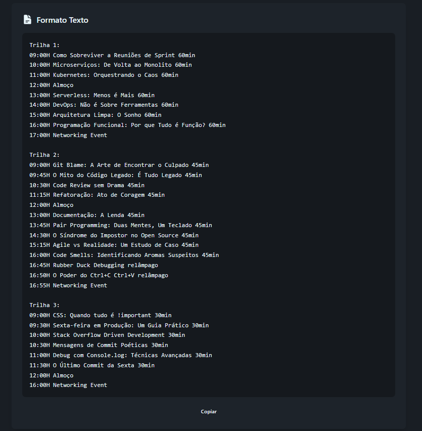
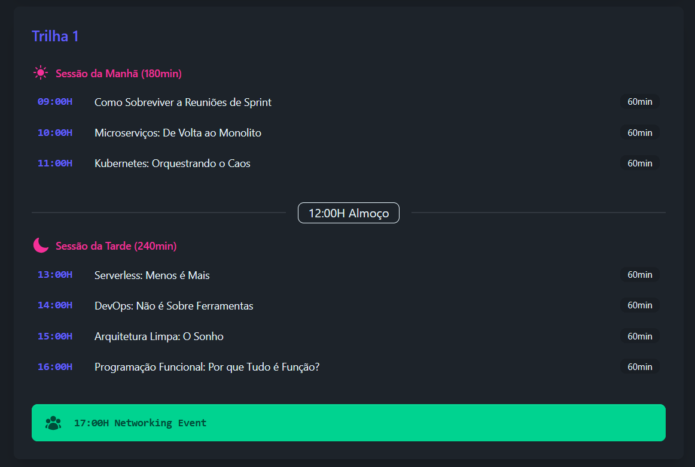
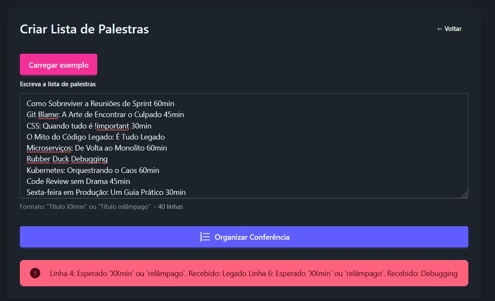

# Descrição

Esse projeto foi desenvolvido como teste técnico para o processo seletivo do `Grupo D. Andrade`, onde tive que fazer uma aplicação em .NET dentro do prazo estipulado de 48 horas.

# Requisitos

## Backend
| Requisito | Versão |
|-----------|--------|
| .NET SDK | `10.0.x` |
| ASP.NET Runtime | `10.0.x` |

## Frontend
| Requisito | Versão |
|-----------|--------|
| Node.js | `v24.16.0` |
| npm | `11.13.0` |

## Opcional
| Ferramenta | Uso |
|------------|-----|
| Bruno | Testes de API (Disponíveis na pasta `Tests`) |

# Instalação e Execução

- Clonar repositório para uma pasta de sua escolha
- Navegar até a pasta do projeto
- Executar o comando:
```shell
dotnet run --project "GerenciamentoConferencias.Server/GerenciamentoConferencias.Server.csproj"
```
- Após instalar os pacotes do Nuget e NPM, a aplicação estará disponível nas seguintes portas:

| Tecnologia | Porta |
|-----------|--------|
| Site - Vue.Js | `https://localhost:60638/` |
| API - .NET  | `https://localhost:7016/` |

# Prints



